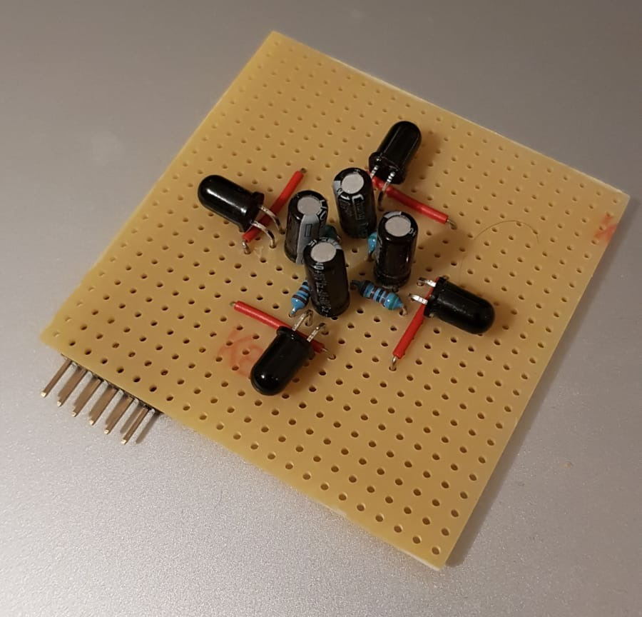
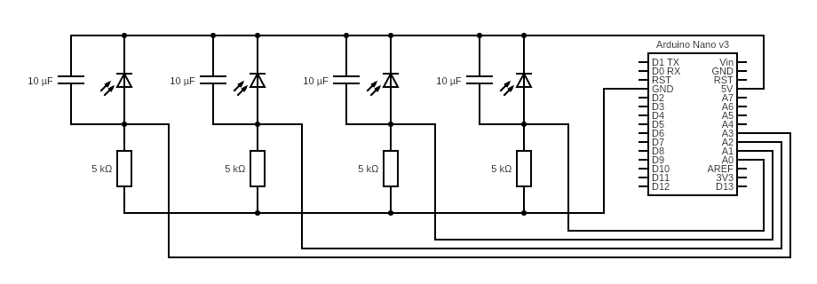

# IR Documentation

## Basic principle of work
The aim is to determine the direction of an infrared source with 4 IR diodes orthogonal to each other.
In this project IR333C light emitting diodes and PT334-6B phototransistors were used.
Each phototransistor is used in reverse direction and connected to the Arduino's ADC with a voltage divider circuit.
The atmega328p converts the analog signal of each phototransitor into a digital signal. The voltage difference is measured between a defined reference voltage and the phototransitor. The noisy analog signal is smoothed with a low-pass filter via a capacitor.


### Hardware components
* `IR emitting diodes`: 6x IR333C 
* `IR phototransitors`: 4x PT334-6B 
* `capacitors`: 4x 10µF
* `resistors`: 4x 5kΩ
* `atmega328p`: Arduino Nano V3

### Circuit


## Interface

## Dependencies
* avr/io.h
* util/delay.h
* stdio.h

### Functions
* `ADC_Init()`: Initialize ADC
* `uint16_t ADC_Read( uint8_t channel );`: Get current voltage. (0-1024) true voltage=ADC_Read*5V/1024
* `uint16_t ADC_Read_Avg( uint8_t channel, uint8_t nsamples );`:  Get current average voltage. (0-1024) true voltage=ADC_Read_Avg*5V/1024
* `uint16_t getDirection(void);`: Get the current direction of the highest infrared light intensity. (0,90,180,270)

### Example Usage
```c++
#include "ir.h"
#include "lib/usart.h"

#define F_CPU 16000000
#define FOSC 16000000 
#define BAUD 9600
#define MYUBRR FOSC/16/BAUD-1


int main(void){
    USART_init(MYUBRR);
    uint16_t direction;
    ADC_Init();
    while(1){
        direction = getDirection();

    	char puffer[20];
		sprintf( puffer, "- %i",direction);
	  	USART_println(puffer);


    }
}
```


